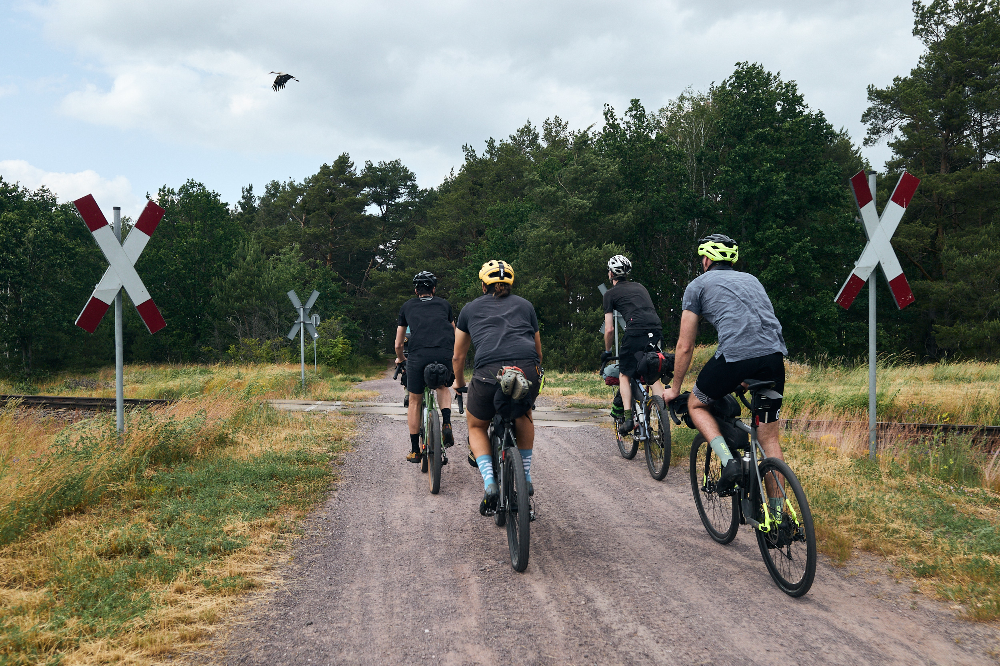
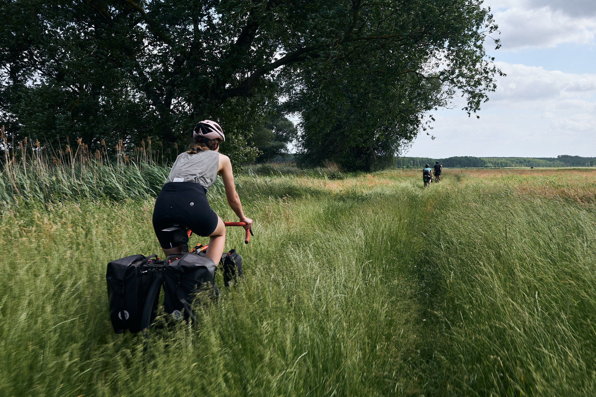
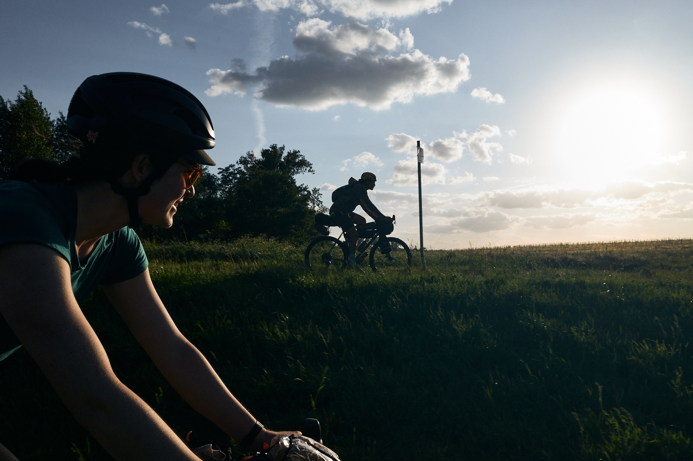
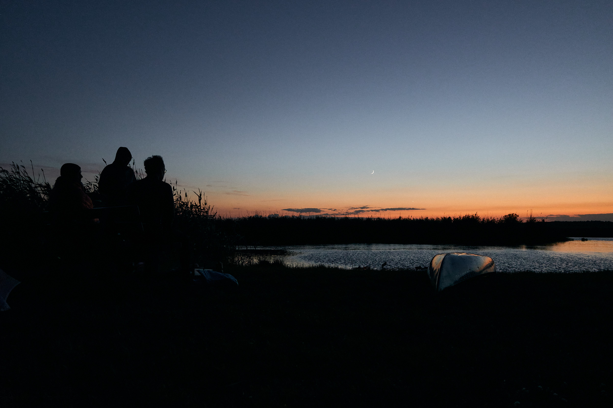
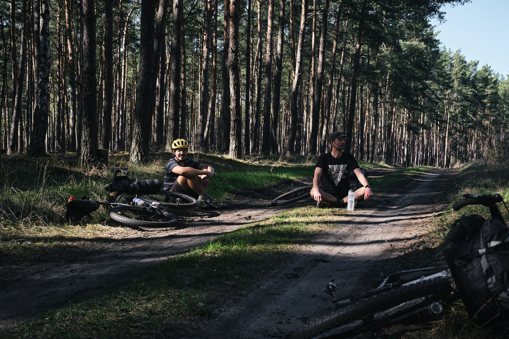
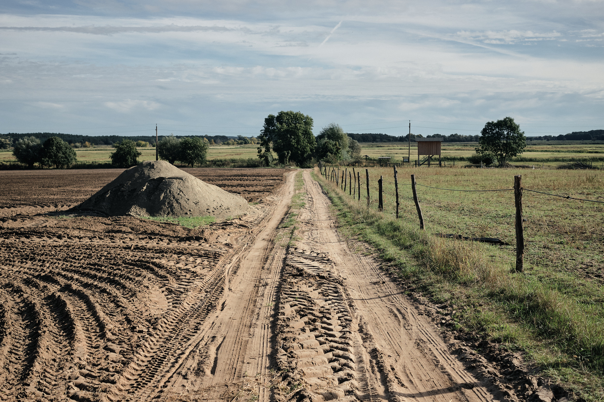

**Brandenburg**

Situated just beyond Berlin and meandering its way through the Westhavelland Nature Park, the Havel Wetland Wander is a 170-kilometer mixed-surface weekend route that takes riders through a scenic and serene region that's teeming with wildlife. It boasts empty forests, uniquely dark skies for stargazing, and a glimpse of typical eastern German towns.  Find the full route guide on <a href="https://bikepacking.com/routes/havel-wetland-wander/" target="_blank">BIKEPACKING.com</a>…
{: class="copy"}

{: class="image-content"}

