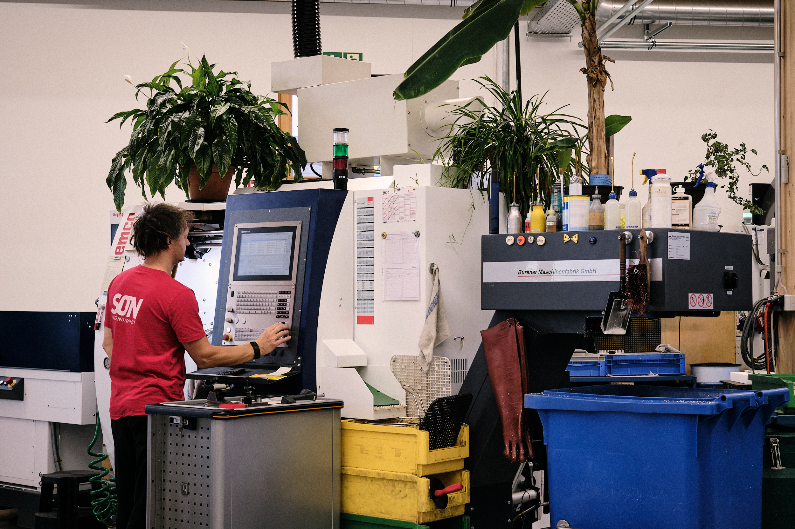
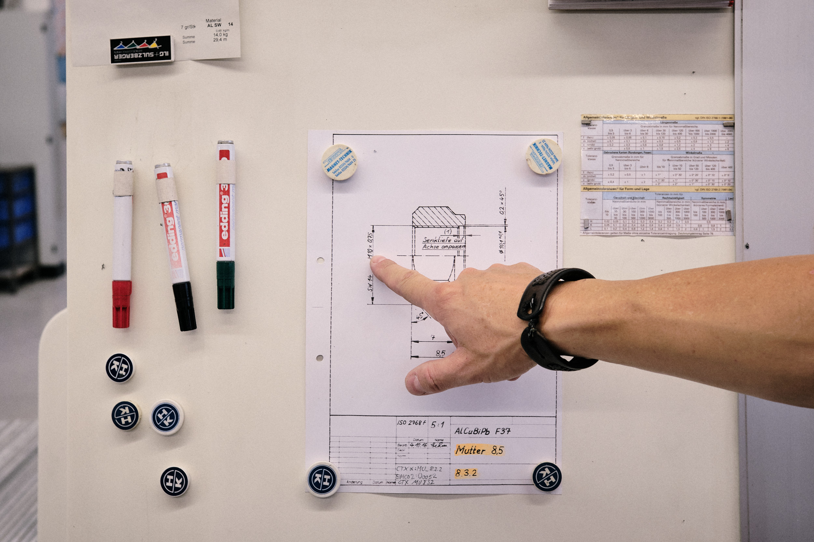
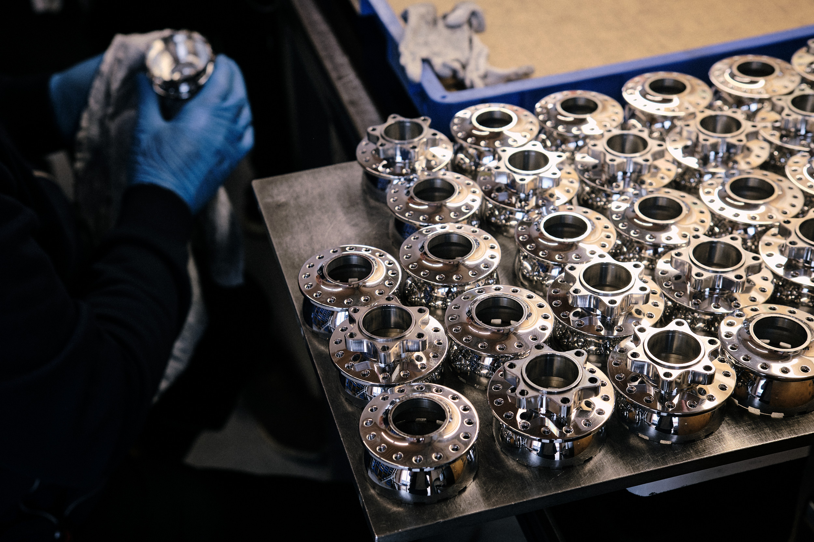
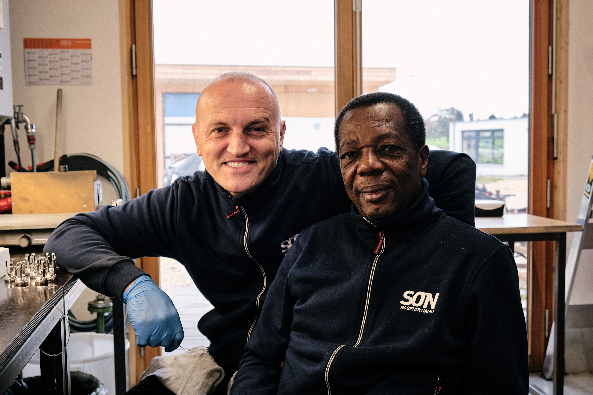
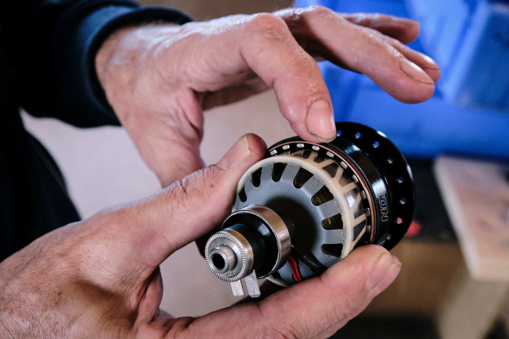
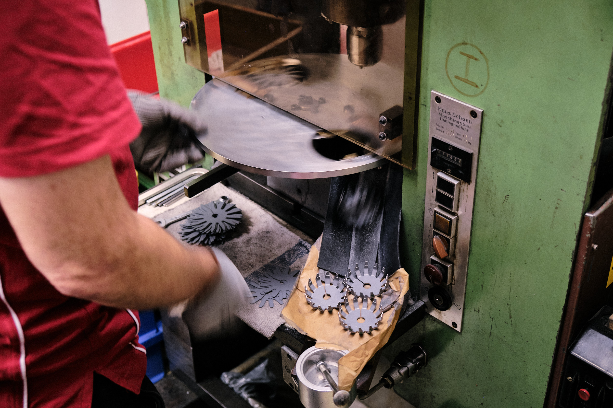
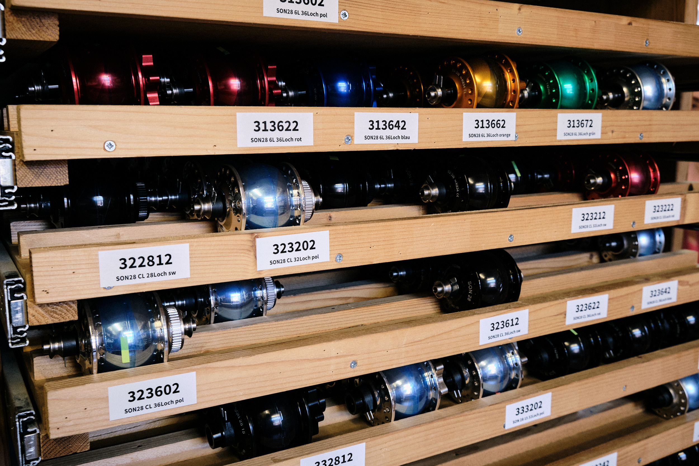
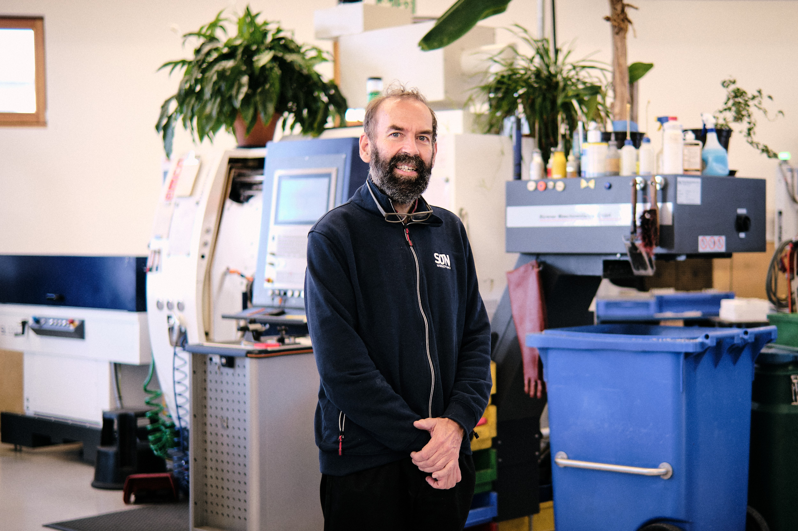

**Tübingen, Germany – 2022**

Few things are as transformational to a bicycle’s character as always-on, dynamo-powered lighting. A visit to the industrious engineers at <a href="https://nabendynamo.de/" target="_blank">Schmidt Maschinenbau</a> in Tübingen revealed the inner workings of the legendary SON dynamo hub that kickstarted the bike lighting revolution. Find a deep dive into the past, present, and future of the small company and learn what makes SON hubs a cut above the rest on <a href="https://bikepacking.com/plog/inside-son-dynamo-hubs/" target="_blank">BIKEPACKING.com</a>...
{: class="copy"}

{: class="image-content"}

