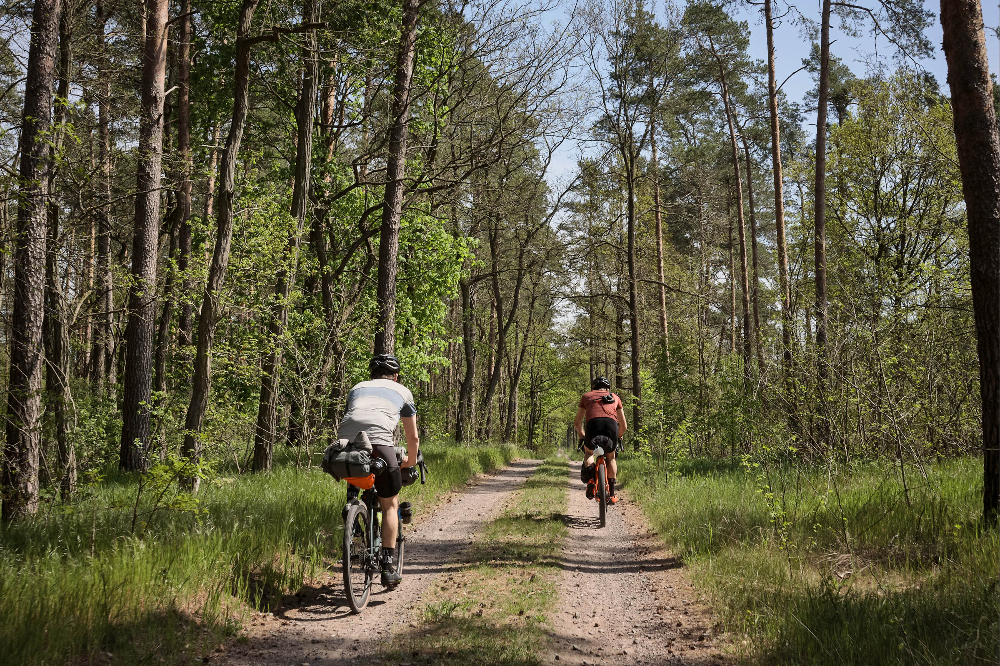
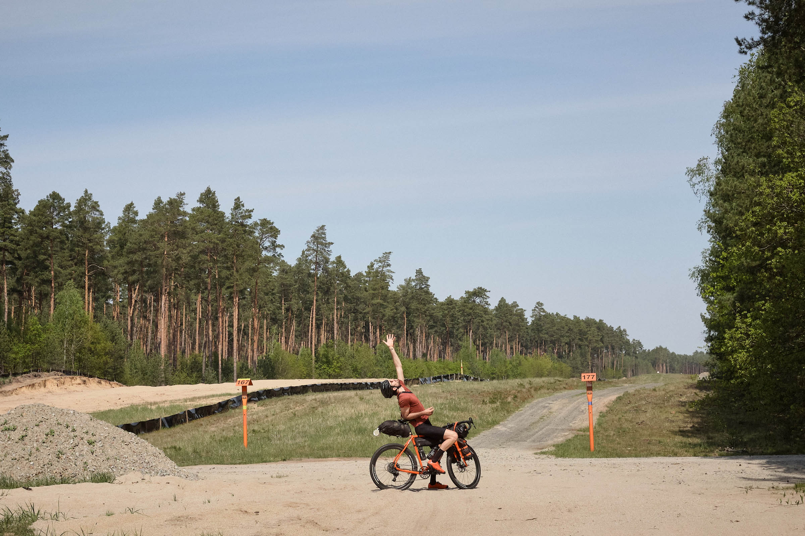
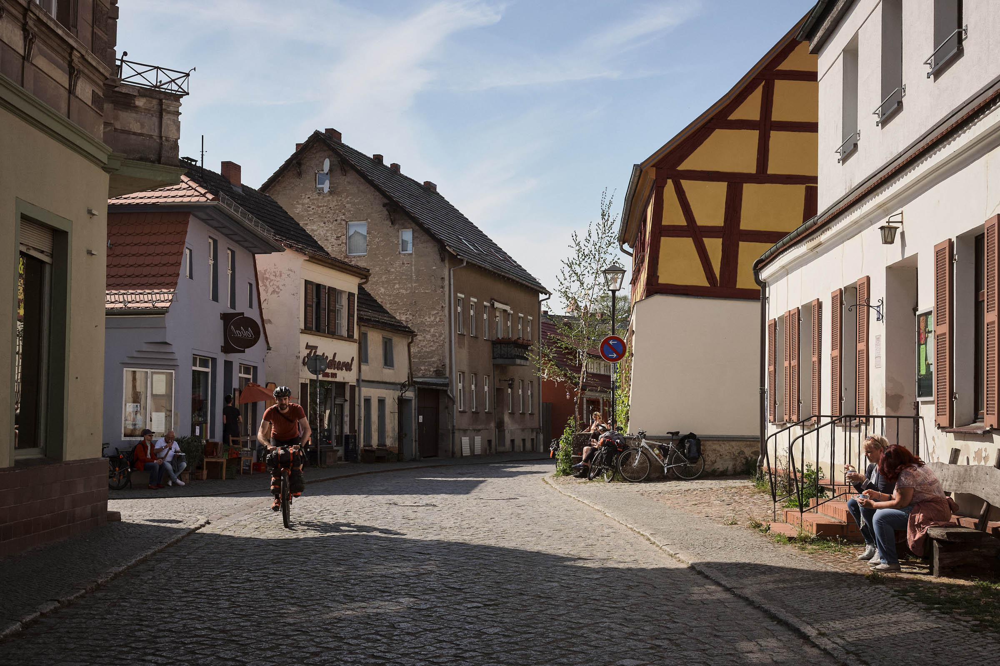
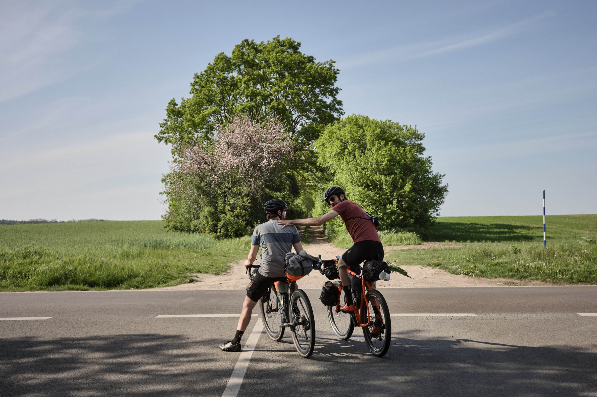
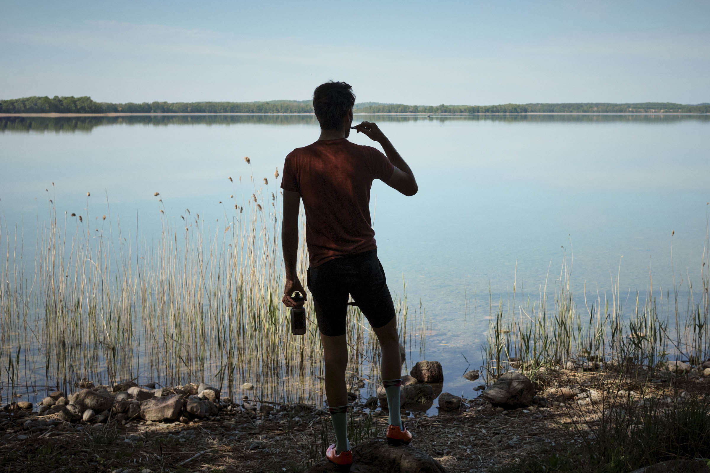
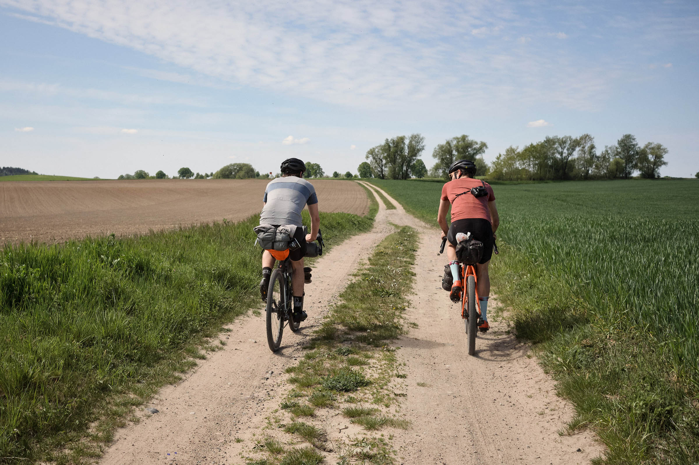

**Brandenburg**

The Lost-in-Brandenburg Loop is an easily accessible mixed-surface overnight bikepacking route that covers the rural and forested north-east of Brandenburg. Exiting the Berlin metro area, the loop travels over the area's infamous sandy and cobbled doubletracks, weaving in bouts of gravel, mellow singletrack, and smooth tarmac. Get lost and find yourself in the endless pine forests and tiny towns seemingly stuck in time. Find the full route guide on <a href="https://bikepacking.com/routes/lost-in-brandenburg-loop/" target="_blank">BIKEPACKING.com</a>…
{: class="copy"}

{: class="image-content"}

