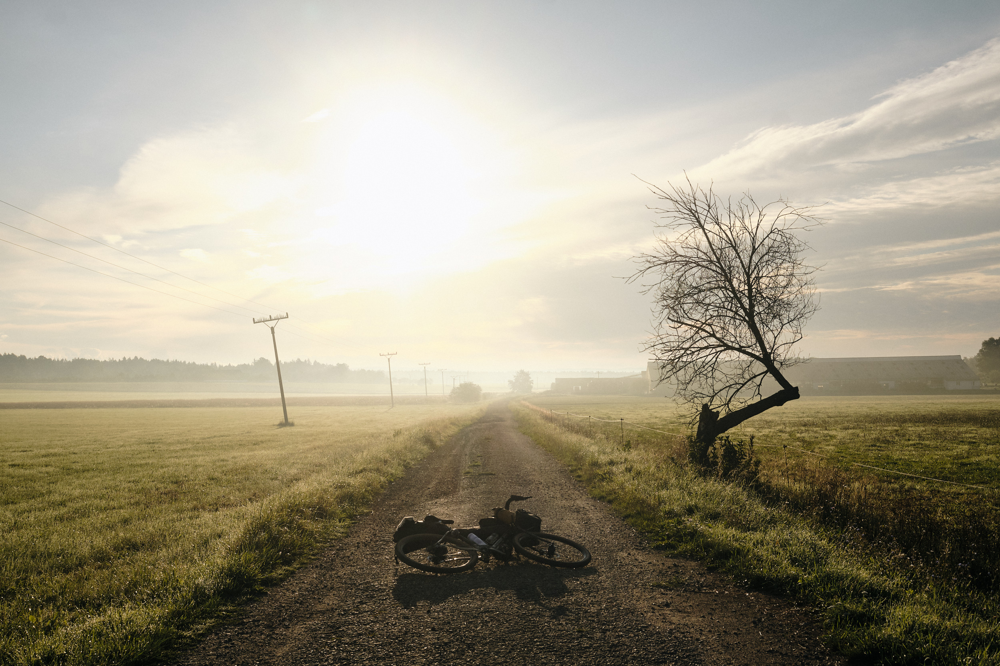

**Europe – 2022**

Made for fast gravel riding, bikepacking, and long-distance randonneuring, the updated <a href="https://pelagobicycles.com/stavanger/" target="_blank">Pelago Stavanger</a> allroad bike promises the world of versatility with none of the compromises. Joshua Meissner took it across all types of roads and trails throughout Europe this summer, testing its worth as a go-anywhere, do-anything drop-bar bikepacking rig. Find his detailed review on <a href="https://bikepacking.com/plog/inside-son-dynamo-hubs/" target="_blank">BIKEPACKING.com</a>…    
With bikepacking bags by <a href="https://www.gramm-tourpacking.com/" target="_blank">Gramm</a> and <a href="https://outershell.com/" target="_blank">Outer Shell</a>. 
{: class="copy"}

{: class="image-content"}

