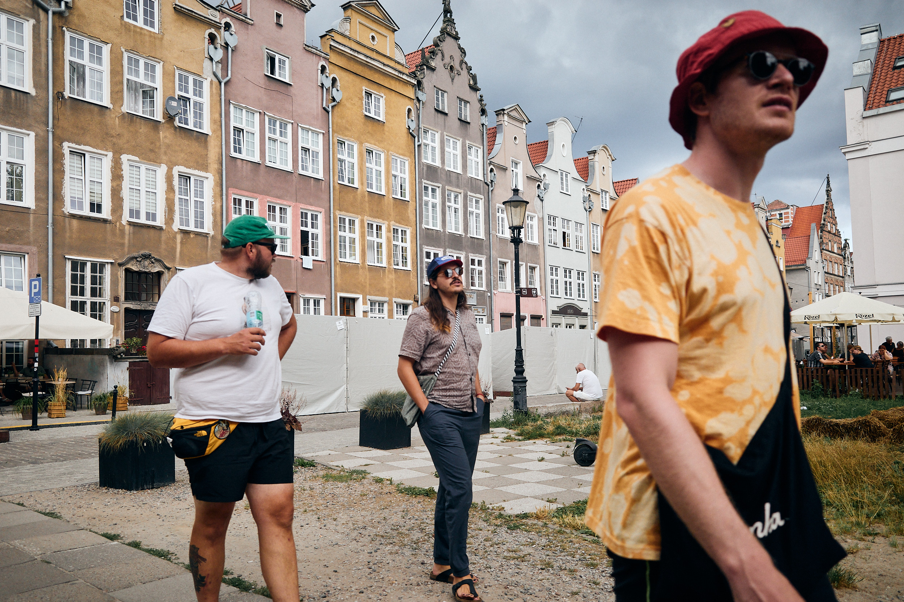
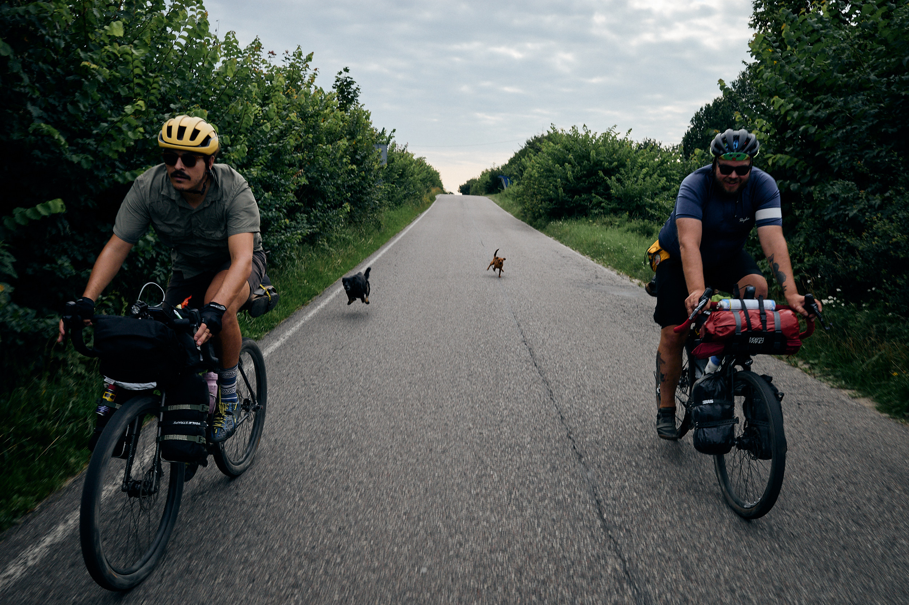
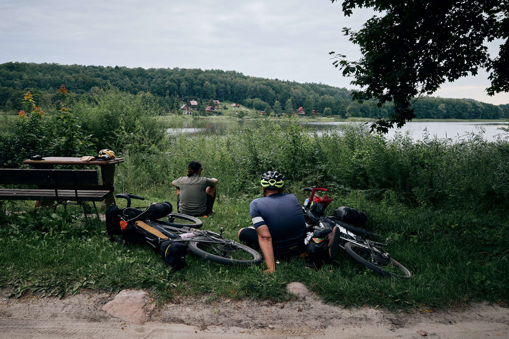
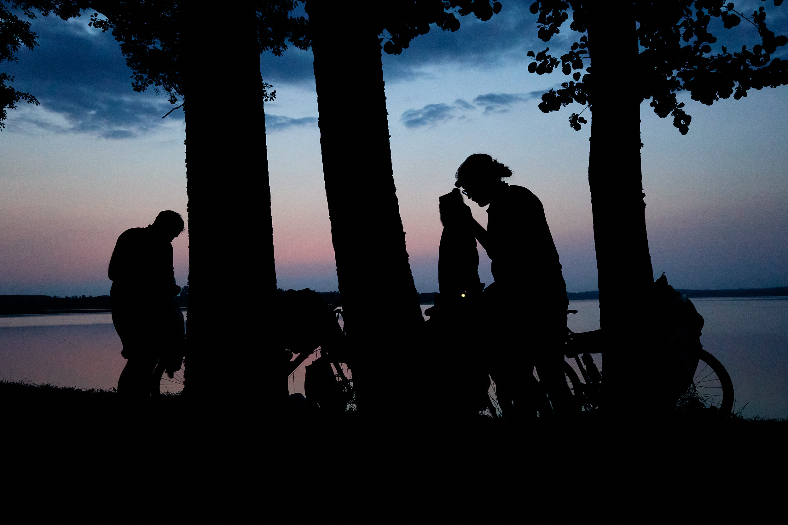
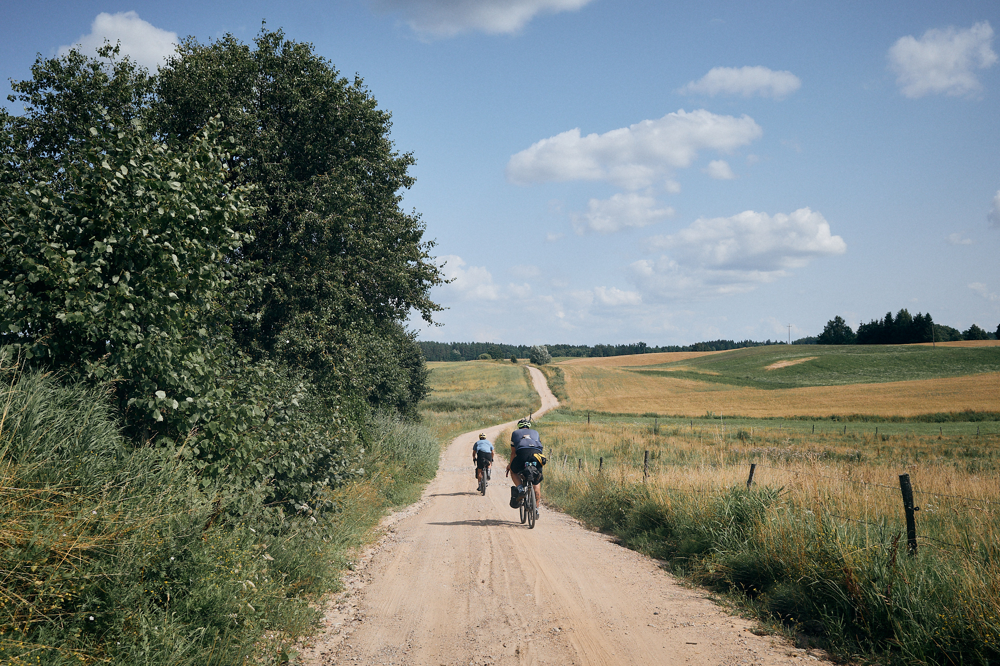
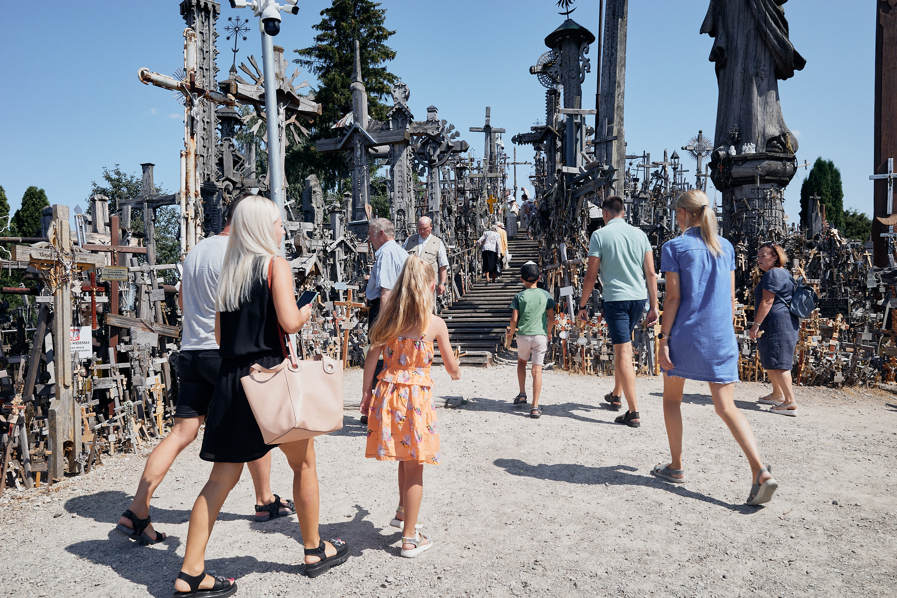
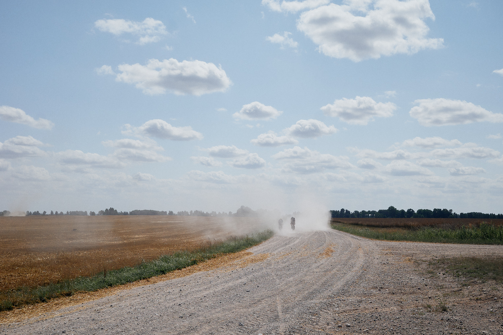
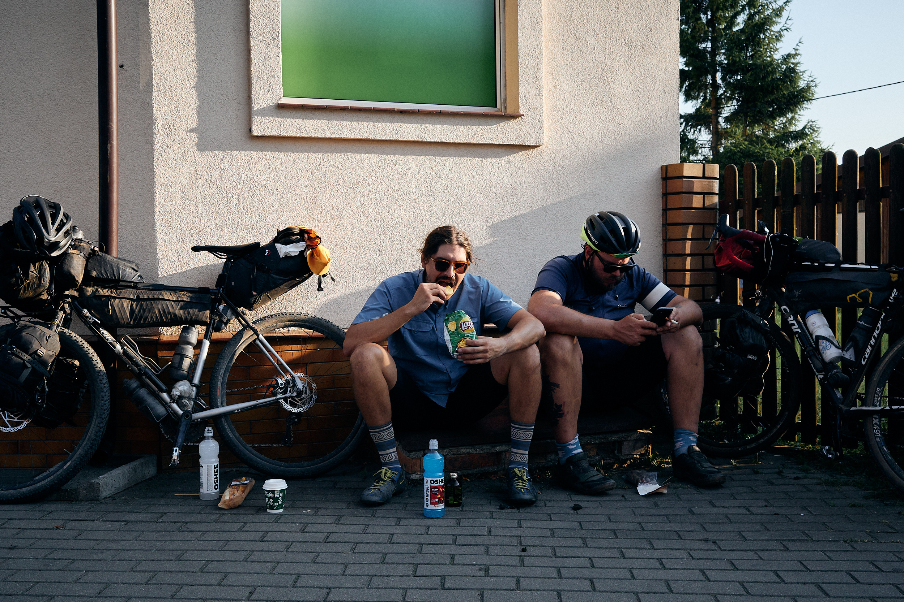
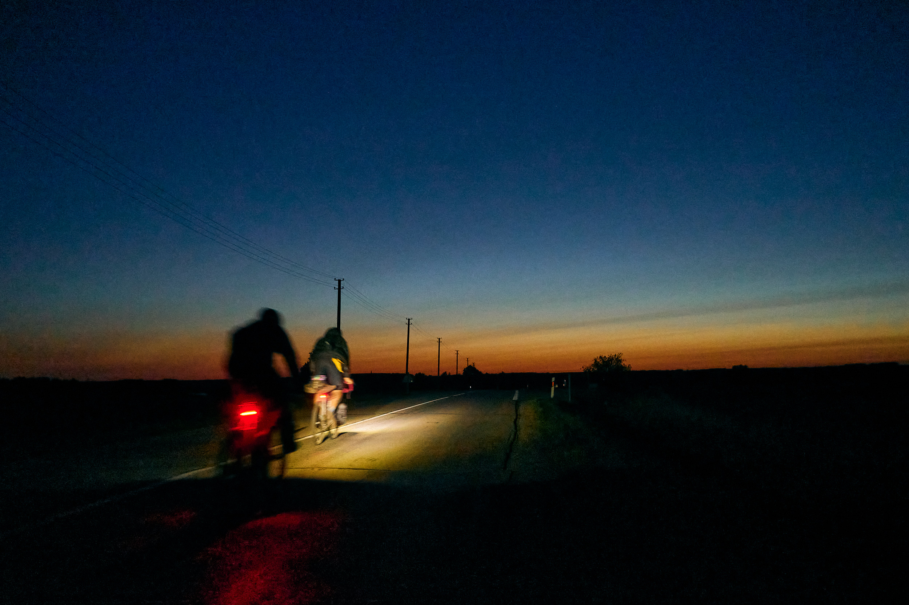

**The Baltics – 2021**

Poor planning had my friends and me caught between Latvia and a hard place a few summers ago. To make our rendezvous with our other friends in Riga, we had to work overtime to get ourselves two countries down the road. Find my story of a cycling tour turned impromptu bikepacking race against the clock and a gallery of photos on <a href="https://bikepacking.com/plog/riga-calling-bikepacking-the-baltics/" target="_blank">BIKEPACKING.com</a>...
{: class="copy"}

{: class="image-content"}

