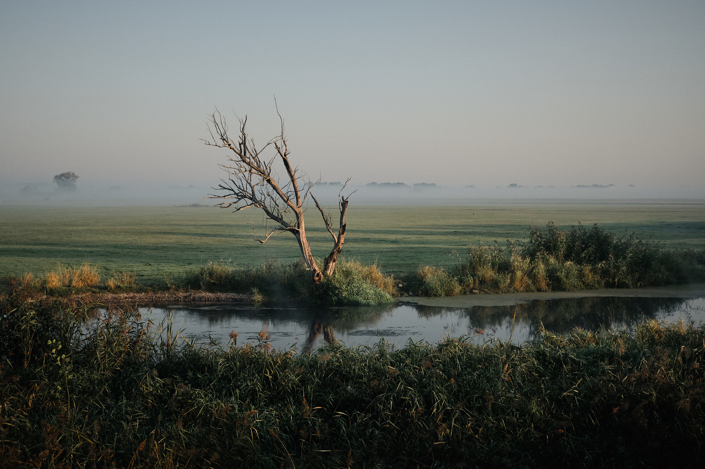
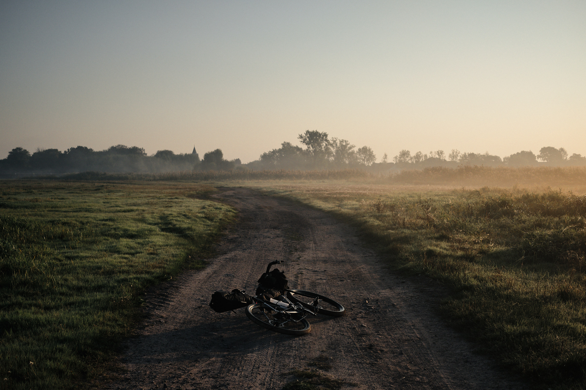
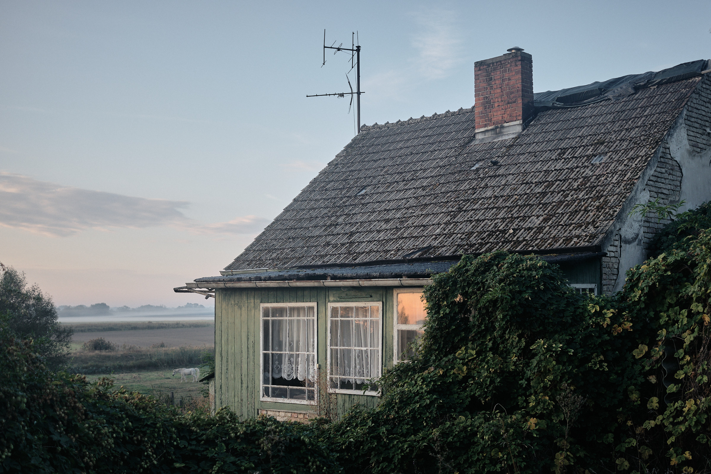
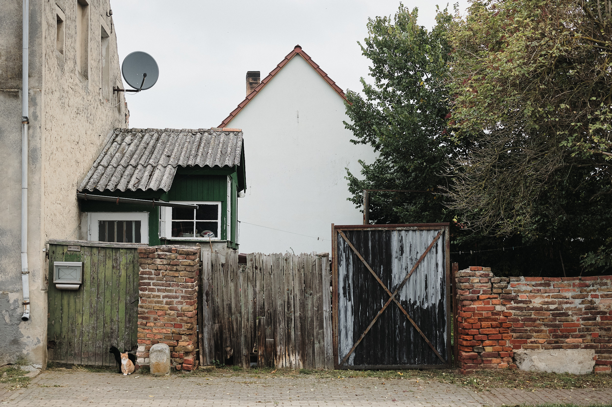
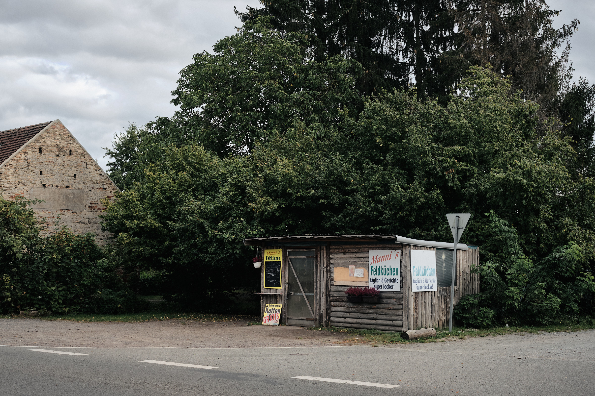
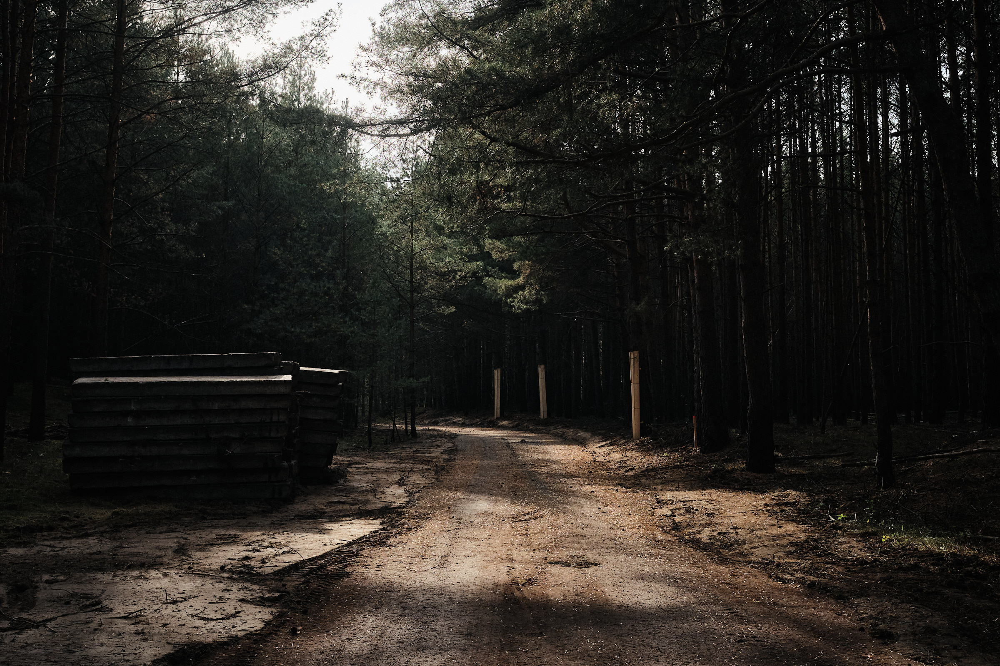
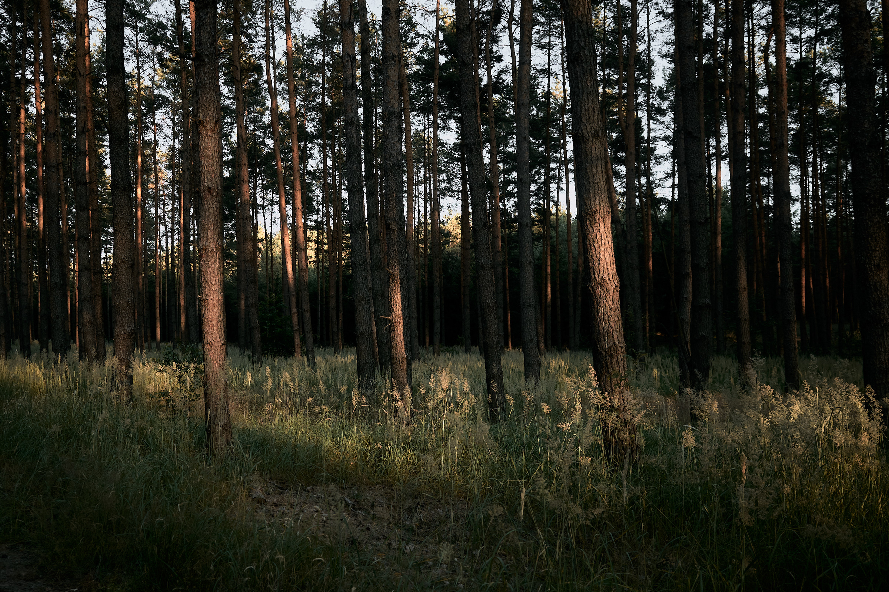
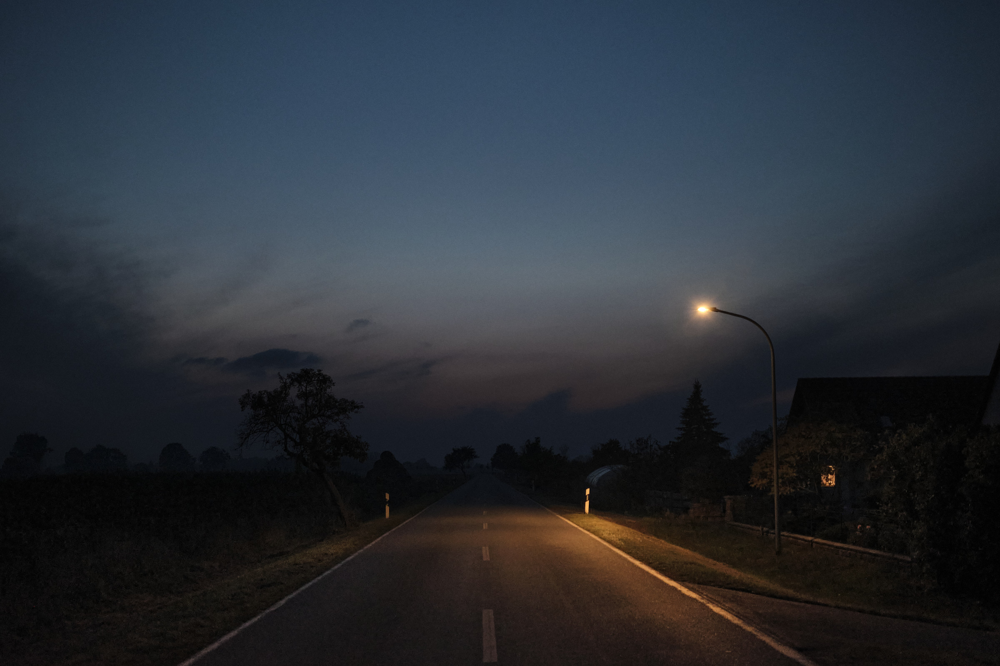

**Brandenburg – 2020**

Originally published on paper in the fifth issue of The Bikepacking Journal, Slower is a pertinent piece about taking the time to appreciate your own backyard, no matter where that may be. Read my story of tuning in to the often overlooked wonders of rural Eastern Germany on <a href="https://bikepacking.com/stories/slower/" target="_blank">BIKEPACKING.com</a>…
{: class="copy"}

{: class="image-content"}

